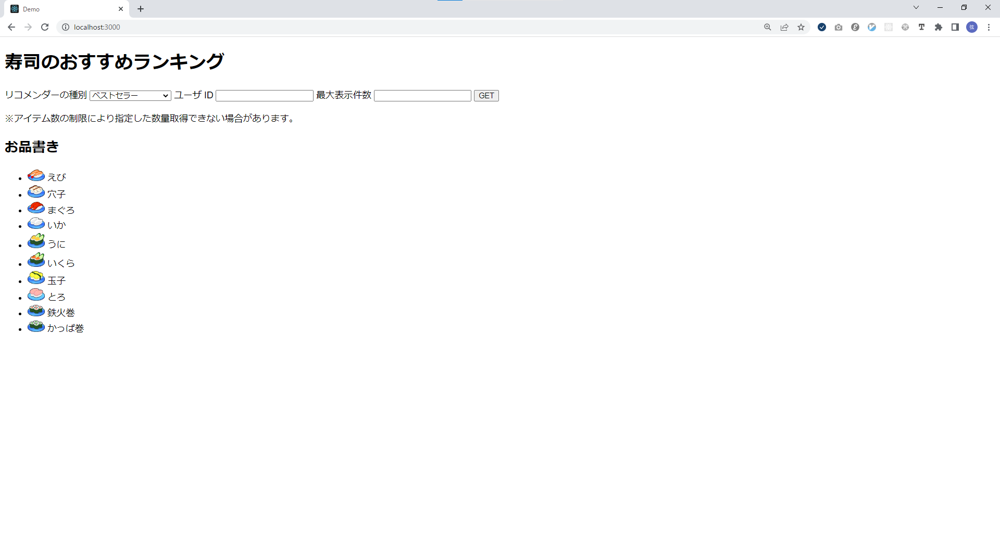
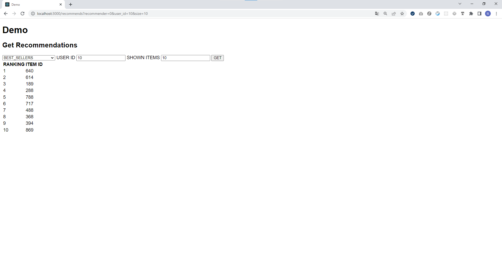
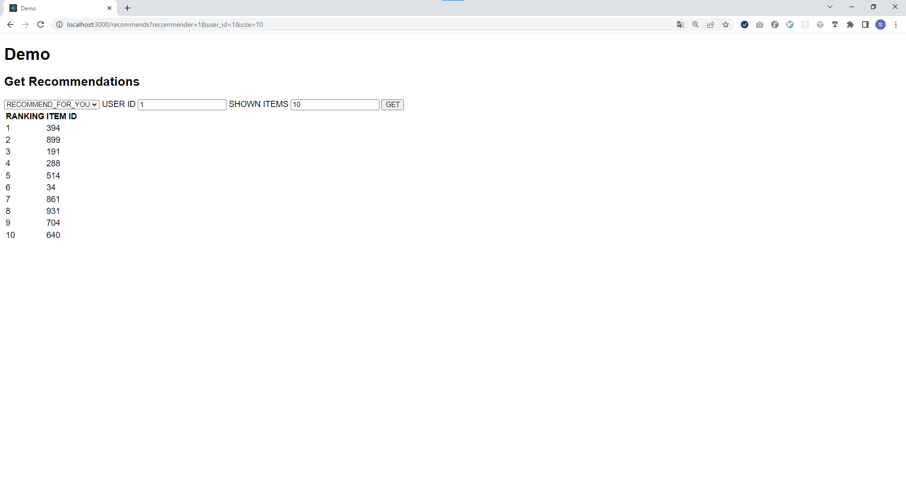
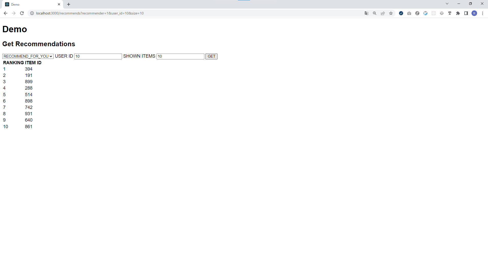

# CapsuleCloud Personalize Demo

## リポジトリの説明

Amazon Personalizeの機能を紹介するデモ。

## 利用方法

### １．事前準備

- Amazon Personalizeで利用するデータセットのスキーマは`./schema.json`にて以下の通り定義されている。

```(json)
{
  "type": "record",
  "name": "Interactions",
  "namespace": "com.amazonaws.personalize.schema",
  "fields": [
    {
      "name": "USER_ID",
      "type": "string"
    },
    {
      "name": "ITEM_ID",
      "type": "string"
    },
    {
      "name": "EVENT_TYPE",
      "type": "string"
    },
    {
      "name": "TIMESTAMP",
      "type": "long"
    }
  ],
  "version": "1.0"
}
```

- 以下のコマンドを実行することで学習用のランダムなダミーデータを生成できる。

```(shell)
python generate_interraction_date.py
```

- `generated_interaction_date.csv`が生成されたことを確認する。このCSVは以下のようなデータとなる。

```(csv)
USER_ID,ITEM_ID,EVENT_TYPE,TIMESTAMP
193,438,Purchase,1639718210
900,251,View,1618553835
637,926,Purchase,1630896977
824,65,View,1629775849
653,434,Purchase,1637710157
119,619,Purchase,1633249672
359,893,View,1630425573
845,868,View,1628847019
928,822,Purchase,1633454262
...
```

- 適当なS3バケットにCSVをアップロードしておく

- Amazon Personalize用のIAMロールを作成し、以下の権限を付与しておく
  - CSVをアップロードしたS3バケットへのGetObject, ListBucket

- S3バケットのバケットポリシーで、以下の許可を設定しておく
  - Amazon Personalize用に作成したIAMからのGetObject, ListBucket

## ２．Amazon Personalizeに新たなDataset Groupを作成する

1. コンソールにサインイン
2. Amazon Personalizeダッシュボード二アクセス
3. Dataset Groupの作成
4. Dataset GroupのDomainは「E-commerce」を選択
5. 生成したCSVをインタラクションデータとしてインポートするジョブを作成する
6. 作成したジョブが完了したら、Recommenderを作成する
7. Recommenderは`Best sellers`と`Recommended for you`を選択する
8. Recommenderが作成されるまでしばらく待つ
9. 作成されたRecommenderのリソース名を控えておく
10. 完了

## ３．Demoアプリケーションからリコメンドを取得する

### デモアプリケーションの動作環境

- Ruby 3.0.4
- Rails 7.0.3

### Demo用アプリケーションを実行する

- `demo`ディレクトリに移動する

```(shell)
cd ./demo
```

- ライブラリをインストール

```(shell)
bundle install
```

- .envを以下のように編集する

```(text)
AWS_ACCESS_KEY_ID={AWS_ACCESS_KEY_ID}
AWS_SECRET_ACCESS_KEY={AWS_SECRET_ACCESS_KEY}
ARN_PREFIX=arn:aws:personalize:{REGION}:{AWS_ACCOUN_ID}:recommender/
RECOMMEND_FOR_YOU={RECOMMEND_FOR_YOU_RESOURCE_NAME}
BEST_SELLERS={BEST_SELLER_RESOURCE_NAME}
```

※{}で囲われている部分は各々の内容に書き換える

- 起動

```(shell)
rails s
```

### Demo用アプリケーションの動作

#### 操作方法



- セレクトボックスでRecommenderのタイプを選択する
- USER IDにおすすめを取得するユーザのIDを入力する
- SHOWN ITEMSに取得するランキングの件数を入力する

#### 取得結果

##### BEST SELLERSの場合

###### ITEMのベストセラーランキングなので、すべてのユーザで同じ結果となる



##### RECOMMEND FOR YOUの場合

###### ユーザごとに取得されるおすすめの順位は異なるものになる



